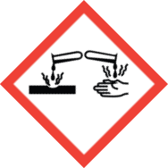

## Ficha com dados de segurança

Substância: **Acetato de cobre II monohidratado**

Fórmula: C~4~H~6~CuO~4~ * H~2~O

Peso molecular: 199,65 g/mol

CAS: 6046-93-1

### Perigo

\ \ \

#### Perigos à saúde

- Toxicidade aguda, Categoria 4, Oral, H302
- Lesões oculares graves, Categoria 1, H318

#### Perigos ao meio ambiente

- Perigoso ao ambiente aquático – Agudo., Categoria 1, H400
- Perigoso ao ambiente aquático – Crônico., Categoria 1, H410

### Frases de perigo

- H302 Nocivo se ingerido
- H318 Provoca lesões oculares graves.
- H410 Muito tóxico para os organismos aquáticos, com efeitos prolongados.

### Frases de precaução

#### Prevenção

- P273 Evite a liberação para o meio ambiente.
- P280 Usar protecção ocular.

#### Resposta de emergência

- P305 + P351 + P338 EM CASO DE CONTATO COM OS OLHOS: Enxágue cuidadosamente com água durante vários minutos. No caso de uso de lentes de contato, remova-as, se for fácil. Continue enxaguando.

### Referência

Para informações completas, consulte a [FDS](https://drive.google.com/file/d/1W5x8rm9qiS13v6WjkOuznIq8InPd90HV/view) do produto.
