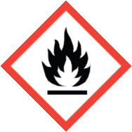

## Ficha com dados de segurança

Substância: **Ácido acético glacial**

Fórmula: CH~3~COOH

Peso molecular: 60,05 g/mol

CAS: 64-19-7

### Perigo

 

#### Perigos físicos

- Líquido inflamável, Categoria 3, H226
- Corrosivo para os metais, Categoria 1, H290

#### Perigos à saúde

- Corrosivo para a pele, Categoria 1A, H314

### Frases de Perigo

- H226 Líquido e vapores inflamáveis.
- H290 Pode ser corrosivo para os metais.
- H314 Provoca queimadura severa à pele e dano aos olhos.

### Frases de Precaução

#### Prevenção

- P210 Mantenha afastado do calor/ faísca/ chama aberta/ superfícies quentes. Não fume.
- P280 Use proteção ocular/ luvas de proteção/ roupas de proteção.

#### Resposta à emergência

- P301 + P330 + P331 NÃO provoque vômito.
- P305 + P351 + P338 EM CASO DE CONTATO COM OS OLHOS: Enxágue cuidadosamente com água durante vários minutos. No caso de uso de lentes de contato, remova-as, se for fácil. Continue enxaguando.
- P308 + P310 EM CASO DE exposição ou suspeita de exposição: contate imediatamente um CENTRO DE INFORMAÇÃO TOXICOLÓGICA ou um médico.

### Referência

Para informações completas, consulte a [FDS](https://drive.google.com/open?id=1nf4_Gno8ClwcCEOmuV0y6JTCm4mcfGZc) do produto.
